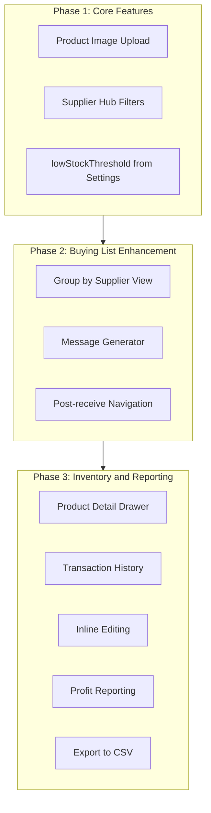

# Iteration 5: Features + Reporting

## Overview

This iteration completes the remaining MVP features and adds advanced inventory/reporting capabilities. Authentication is deferred to Iteration 6.




---

## Phase 1: Core Features

### 1.1 Product Image Upload

**Backend** - [server/src/routes/products.ts](server/src/routes/products.ts)

- Add `POST /api/products/:id/images` endpoint
- Accept multipart/form-data with image file
- Upload to Firebase Storage bucket: `products/{productId}/{filename}`
- Return public URL, append to product's `imageUrls` array
- Add `DELETE /api/products/:id/images/:index` to remove images

**Frontend** - [src/components/inventory/InventoryView.tsx](src/components/inventory/InventoryView.tsx)

- Add image upload button/dropzone in product row or detail view
- Preview images before upload
- Show upload progress
- Display existing images with delete option

### 1.2 Supplier Hub Filters

**Backend** - [server/src/routes/suppliers.ts](server/src/routes/suppliers.ts)

- Update `GET /api/suppliers/items/all` to accept query params:
  - `?supplier={supplierId}` - filter by supplier
  - `?brand={brand}` - filter by brand
  - `?availability={uploaded|sold|waiting}` - filter by status

**Frontend** - [src/components/supplier/SupplierHubView.tsx](src/components/supplier/SupplierHubView.tsx)

- Add filter dropdowns above the items grid:
  - Supplier select (populated from suppliers list)
  - Brand select (unique brands from items)
  - Availability select (uploaded/sold/waiting)
- Update URL params on filter change
- Filter items client-side or refetch with params

### 1.3 lowStockThreshold from Settings

**Backend** - [server/src/routes/dashboard.ts](server/src/routes/dashboard.ts)

- Import `SettingsRepo` and fetch settings
- Replace hardcoded `lowStockThreshold = 2` with `settings.lowStockThreshold`

```typescript
const settings = await settingsRepo.getSettings()
const lowStockThreshold = settings?.lowStockThreshold ?? 2
```

---

## Phase 2: Buying List Enhancement

### 2.1 Group by Supplier View

**Frontend** - [src/components/buying-list/BuyingListView.tsx](src/components/buying-list/BuyingListView.tsx)

- Add view toggle: "List" | "By Supplier" (currently "Bulk" placeholder)
- Group items by `supplierId` (items without supplier go to "Unassigned")
- Show supplier name as section header with item count and total value
- Collapsible sections

```typescript
const groupedBySupplier = useMemo(() => {
  const groups: Record<string, BuyingListItemWithId[]> = {}
  items.forEach(item => {
    const key = item.supplierId || 'unassigned'
    if (!groups[key]) groups[key] = []
    groups[key].push(item)
  })
  return groups
}, [items])
```

### 2.2 Message Generator

**Schema** - [shared/src/schemas/supplier.ts](shared/src/schemas/supplier.ts)

- Add optional fields to SupplierSchema:

```typescript
whatsappNumber: z.string().optional(),
messageTemplate: z.string().optional(), // e.g. "Hi {contactName}, I'd like to order: {items}"
```

**Frontend** - [src/components/buying-list/BuyingListView.tsx](src/components/buying-list/BuyingListView.tsx)

- In group-by-supplier view, add "Generate Message" button per supplier section
- Modal/drawer with:
  - Pre-filled message listing items (brand, model, target price)
  - Copy to clipboard button
  - "Open WhatsApp" link (`https://wa.me/{number}?text={encoded}`)
  - "Open Email" link (`mailto:{email}?subject=Order&body={encoded}`)

### 2.3 Post-receive Navigation

**Frontend** - [src/components/buying-list/BuyingListView.tsx](src/components/buying-list/BuyingListView.tsx)

- After successful receive, show toast with "View in Inventory" link
- Or auto-navigate to `/inventory?q={brand}+{model}` after short delay

---

## Phase 3: Inventory and Reporting

### 3.1 Product Detail Drawer

**Frontend** - Create [src/components/inventory/ProductDetailDrawer.tsx](src/components/inventory/ProductDetailDrawer.tsx)

- Slide-out drawer triggered by clicking product row
- Sections:
  - **Images**: Gallery with upload/delete
  - **Details**: All product fields (editable)
  - **Financials**: Cost, sell price, margin calculation
  - **History**: Linked transactions, evaluations
  - **Notes**: Editable notes field
- Save/Cancel buttons

### 3.2 Transaction History

**Backend** - [server/src/routes/products.ts](server/src/routes/products.ts)

- Add `GET /api/products/:id/transactions` endpoint
- Query transactions where `productId` matches

**Frontend** - In ProductDetailDrawer

- Show transaction list: date, type (purchase/sale/adjustment), amount
- Link to create new transaction (sale, adjustment)

### 3.3 Inline Editing

**Frontend** - [src/components/inventory/InventoryView.tsx](src/components/inventory/InventoryView.tsx)

- Double-click cell to edit (or edit icon)
- Editable fields: status, quantity, sellPriceEur, notes
- Auto-save on blur or Enter
- Show saving indicator
- Use `apiPut('/products/{id}', { field: value })`

### 3.4 Profit Reporting

**Backend** - [server/src/routes/dashboard.ts](server/src/routes/dashboard.ts)

- Add `GET /api/dashboard/profit-summary` endpoint:

```typescript
{
  totalCost: number,      // sum of costPriceEur for sold items
  totalRevenue: number,   // sum of sellPriceEur for sold items  
  totalProfit: number,    // revenue - cost
  marginPct: number,      // profit / revenue * 100
  itemsSold: number,
  avgMarginPct: number
}
```

**Frontend** - [src/components/dashboard/DashboardView.tsx](src/components/dashboard/DashboardView.tsx)

- Add "Profit Summary" card or section
- Show total profit, margin %, items sold
- Optional: mini chart of sales over time

### 3.5 Export to CSV

**Frontend** - [src/components/inventory/InventoryView.tsx](src/components/inventory/InventoryView.tsx)

- Add "Export" button in header
- Generate CSV with columns: Brand, Model, Category, Condition, Cost, Sell, Status, Quantity
- Trigger browser download

```typescript
const exportToCSV = () => {
  const headers = ['Brand', 'Model', 'Category', 'Condition', 'Cost EUR', 'Sell EUR', 'Status', 'Quantity']
  const rows = filteredProducts.map(p => [p.brand, p.model, p.category, p.condition, p.costPriceEur, p.sellPriceEur, p.status, p.quantity])
  const csv = [headers, ...rows].map(r => r.join(',')).join('\n')
  // trigger download
}
```

---

## File Changes Summary


| Area               | Files                                                                                                                                                                                      |
| ------------------ | ------------------------------------------------------------------------------------------------------------------------------------------------------------------------------------------ |
| **Backend Routes** | `server/src/routes/products.ts`, `server/src/routes/suppliers.ts`, `server/src/routes/dashboard.ts`                                                                                        |
| **Schemas**        | `shared/src/schemas/supplier.ts`                                                                                                                                                           |
| **Frontend Views** | `src/components/inventory/InventoryView.tsx`, `src/components/supplier/SupplierHubView.tsx`, `src/components/buying-list/BuyingListView.tsx`, `src/components/dashboard/DashboardView.tsx` |
| **New Components** | `src/components/inventory/ProductDetailDrawer.tsx`, `src/components/buying-list/MessageGeneratorModal.tsx`                                                                                 |


---

## Iteration 5 Goals (for .cursor/rules)

```
## Iteration 5 goal (priority order)
1) Features: Product image upload to Firebase Storage + Supplier Hub filters
2) Buying List: Group-by-supplier view + message generator (WhatsApp/Email)
3) Inventory: Product detail drawer + inline editing + transaction history
4) Reporting: Profit summary + CSV export
5) Polish: lowStockThreshold from settings, post-receive navigation
```

---

## Testing Plan

- **Unit tests**: Profit calculation, CSV export formatting
- **E2E tests**: Image upload flow, filter persistence, message generation
- **Manual**: Test WhatsApp/Email links open correctly with pre-filled content

