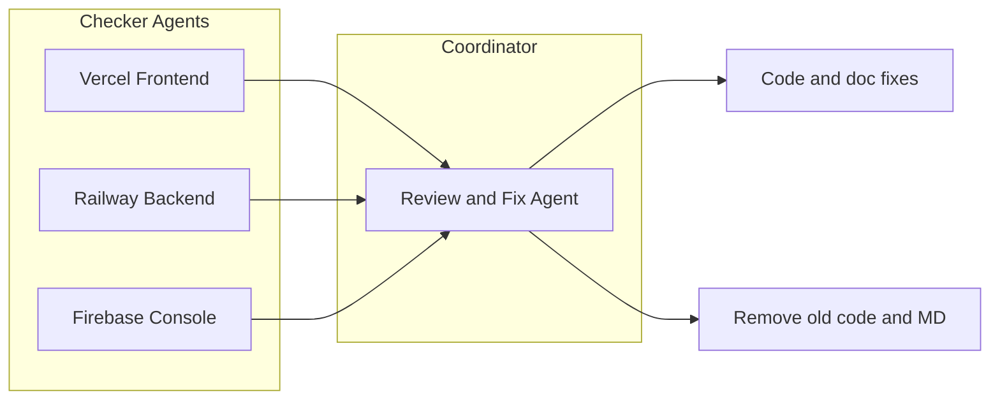

# Deployment Checker Agents and Review-and-Fix Coordinator Playbook

**Purpose:** Define a structured QA workflow for verifying Vercel (frontend), Railway (backend), and Firebase Console configurations, then coordinate fixes to code, docs, and cleanup of obsolete content.

**Architecture:** Frontend on Vercel (static Vite build), backend on Railway (Express API), data on Firebase (Firestore + Storage).

## Architecture Overview



---

## Agent 1: Vercel Frontend Check

**Purpose:** Verify the live Vercel app and that configuration matches docs.

**Inputs:**

- Vercel project URL (from `vercel.json` / `docs/PROJECT_STRUCTURE.md` or env)
- `docs/deploy/VERCEL.md`

**Tasks:**

| # | Task | How to Check |
|---|------|--------------|
| 1 | Build and deploy | Vercel dashboard → Deployments: latest build green; build command `npm run build`, output `dist`. Root Directory empty or `app` per `docs/deploy/VERCEL.md`. |
| 2 | Environment variables | Vercel → Settings → Environment Variables: `VITE_FIREBASE_PROJECT_ID`, `VITE_FIREBASE_STORAGE_BUCKET`, `VITE_API_BASE` (production). No trailing slash on `VITE_API_BASE`. |
| 3 | Live URL | Open app URL; no "Backend not configured" banner when `VITE_API_BASE` is set (see `src/lib/api.ts`, `src/LuxselleApp.tsx`). |
| 4 | SPA routing | Navigate to `/inventory`, `/evaluate`, etc.; no 404 (rewrites in `vercel.json`: `(.*)` → `/index.html`). |
| 5 | API connectivity | From live app: dashboard loads, at least one API call succeeds (e.g. KPIs or health). No CORS errors in browser console. |
| 6 | Docs match | `docs/deploy/VERCEL.md` and `docs/deploy/QUICK_START_CHECKLIST.md` Phase 3 list same env vars and steps. |

**Output Format:**

```
Vercel Frontend Check
=====================
Status: PASS/FAIL

Task Results:
✓ 1. Build and deploy: PASS
✗ 2. Environment variables: FAIL - Missing VITE_API_BASE
...

Vercel Project:
- Project ID: luxselle-dashboard-xxxx
- Live URL: https://luxselle-dashboard.vercel.app

Fixes Required:
1. Add VITE_API_BASE in Vercel → Settings → Environment Variables
2. Set value to: https://your-railway-app.railway.app (no trailing slash)
```

---

## Agent 2: Backend Check (Railway)

**Purpose:** Verify the backend API used by the frontend (Railway deployment).

**Inputs:**

- Railway service URL (from Vercel `VITE_API_BASE` or Railway dashboard)
- `docs/deploy/RAILWAY.md`
- `railway.toml`

**Tasks:**

| # | Task | How to Check |
|---|------|--------------|
| 1 | Health endpoint | GET `{RAILWAY_URL}/api/health` returns 200 and body like `{"status":"ok",...}`. |
| 2 | Critical read endpoints | Optional: GET `.../api/products`, GET `.../api/dashboard/kpis` return 200 or 401 (not 502/503/HTML). |
| 3 | CORS | From browser on Vercel origin, API calls do not fail with CORS; backend allows origin (e.g. `packages/server/src/server.ts` and `cors.json` for Storage). |
| 4 | Env and build | Railway → Variables: `FIREBASE_USE_EMULATOR=false`, `FIREBASE_PROJECT_ID`, `FIREBASE_STORAGE_BUCKET`, `GOOGLE_APPLICATION_CREDENTIALS_JSON` or path; `railway.toml` start command `npm run start --workspace=@luxselle/server`. |
| 5 | Logs | Railway → Deployments → View Logs: no unhandled exceptions; Firebase/Railway init messages present. |
| 6 | Docs match | `docs/deploy/RAILWAY.md` matches start command and required env vars. |

**Output Format:**

```
Backend (Railway) Check
=======================
Status: PASS/FAIL

Task Results:
✓ 1. Health endpoint: PASS - Returns {"status":"ok","timestamp":"..."}
✓ 2. Critical endpoints: PASS
✗ 3. CORS: FAIL - CORS error from Vercel origin
...

Railway Service:
- URL: https://luxselle-api.railway.app
- Last Deploy: 2 hours ago

Fixes Required:
1. Update CORS config in packages/server/src/server.ts to allow Vercel origin
2. Add "https://luxselle-dashboard.vercel.app" to allowed origins

Log Excerpts:
[Error] CORS blocked request from https://luxselle-dashboard.vercel.app
```

---

## Agent 3: Firebase Console Check

**Purpose:** Verify Firebase project, Firestore, Storage, rules, and CORS so backend and frontend work.

**Inputs:**

- Firebase project ID (e.g. `luxselle-dashboard` from `.firebaserc` or docs)
- `docs/firebase/FIREBASE_SETUP.md`
- `docs/deploy/PRODUCTION_SETUP.md` Section 1

**Tasks:**

| # | Task | How to Check |
|---|------|--------------|
| 1 | Project and services | Firebase Console: project exists; Firestore Database and Storage enabled; region noted. |
| 2 | Bucket name | Storage bucket name matches backend `FIREBASE_STORAGE_BUCKET` and frontend `VITE_FIREBASE_STORAGE_BUCKET` (e.g. `luxselle-dashboard.firebasestorage.app`). |
| 3 | Service account | Project Settings → Service accounts: key exists; backend (Railway) uses same project (via `GOOGLE_APPLICATION_CREDENTIALS_JSON`). |
| 4 | Firestore rules | Rules deployed: production should deny client access (`allow read, write: if false`) per `docs/deploy/PRODUCTION_SETUP.md`; backend uses Admin SDK. |
| 5 | Storage rules | Storage rules deployed; client write denied; backend uploads via Admin SDK. |
| 6 | Storage CORS | Bucket CORS allows GET (and HEAD) from Vercel origin(s); `docs/firebase/FIREBASE_SETUP.md` and `cors.json` describe `gsutil cors set`. |
| 7 | Data presence | Optional: Firestore has expected collections (e.g. `products`, `settings`); Storage has objects if app uses images. |
| 8 | Docs match | `docs/firebase/FIREBASE_SETUP.md` and `docs/deploy/QUICK_START_CHECKLIST.md` Phase 1 match commands and bucket name. |

**Output Format:**

```
Firebase Console Check
======================
Status: PASS/FAIL

Task Results:
✓ 1. Project and services: PASS
✓ 2. Bucket name: PASS - luxselle-dashboard.firebasestorage.app
✗ 6. Storage CORS: FAIL - CORS not configured
...

Firebase Project:
- Project ID: luxselle-dashboard
- Bucket: luxselle-dashboard.firebasestorage.app
- Region: us-central1

Fixes Required:
1. Run: gsutil cors set cors.json gs://luxselle-dashboard.firebasestorage.app
2. Verify cors.json contains Vercel origin in allowed origins
```

---

## Agent 4: Full Railway Check

**Purpose:** Deeper verification of Railway build, deploy, env, networking, and operations.

**Inputs:**

- Same as Backend Check, plus:
- `docs/deploy/RAILWAY.md` full guide
- `railway.toml`
- `packages/server/package.json`

**Tasks:**

| # | Task | How to Check |
|---|------|--------------|
| 1-6 | Same as Backend Check | Health, read endpoints, CORS, env, logs, docs. |
| 7 | Build | Railway build uses `npm install` (or nixpacks default); no failing build step; Node version aligns with `.nvmrc` if set. |
| 8 | Start command | Deploy start command = `npm run start --workspace=@luxselle/server`; server binds to `process.env.PORT`. |
| 9 | Domain | Railway → Settings → Networking: generated or custom domain; HTTPS. |
| 10 | Variables completeness | All required vars from `docs/deploy/RAILWAY.md` and `docs/deploy/QUICK_START_CHECKLIST.md` Phase 2 present (Firebase, `NODE_ENV`, `PORT`, `BASE_CURRENCY`, etc.). |
| 11 | Idempotency / errors | No repeated crash loops in logs; optional: trigger one write (e.g. create product) and confirm 2xx and data in Firebase. |
| 12 | Docs and code | `railway.toml` matches `docs/deploy/RAILWAY.md`; no contradictory instructions in QUICK_START or PRODUCTION_SETUP. |

**Output Format:**

```
Full Railway Check
==================
Status: PASS/FAIL

Comprehensive Assessment:
✓ Tasks 1-6: See Backend Check results
✓ 7. Build: PASS - Node 18.x, clean build
✓ 8. Start command: PASS
✗ 10. Variables completeness: FAIL
...

Missing Environment Variables:
- BASE_CURRENCY (required for pricing calculations)
- NODE_ENV (should be "production")

Railway Configuration:
- Build: nixpacks (auto-detected)
- Start: npm run start --workspace=@luxselle/server
- Domain: luxselle-api.railway.app (HTTPS enabled)
- Port: Auto-assigned via PORT env var
```

---

## Agent 5: Review and Fix Coordinator

**Purpose:** Consume reports from the four checkers; prioritize issues; apply code and config fixes; remove old code and obsolete MD files.

**Inputs:**

- Outputs from: (1) Vercel Frontend Check, (2) Backend (Railway) Check, (3) Firebase Console Check, (4) Full Railway Check
- Codebase under `src/`, `packages/`, `docs/`, root config

**Tasks:**

| # | Task | Actions |
|---|------|---------|
| 1 | Ingest and prioritize | Parse each checker output; bucket findings into **Blocker** / **High** / **Medium**; merge duplicate items (e.g. same env var missing in two reports). |
| 2 | Fix configuration and docs | Apply fixes that don't require secrets: update `docs/deploy/VERCEL.md`, `docs/deploy/RAILWAY.md`, `docs/firebase/FIREBASE_SETUP.md`, `docs/deploy/QUICK_START_CHECKLIST.md`, `docs/deploy/PRODUCTION_SETUP.md` so they match current behaviour and env vars; fix `cors.json` if CORS fix is documented (no secrets in repo). Add "Owner must set X in Vercel/Railway/Firebase" where fixes require dashboard actions. |
| 3 | Fix code issues | Address code defects that checkers or tests revealed: e.g. CORS in `packages/server/src/server.ts`, API base handling in `src/lib/api.ts`, backend banner in `src/LuxselleApp.tsx`. Run `npm run build` and `npm run test --workspace=@luxselle/server` after changes. |
| 4 | Clean up old code | Identify and remove: dead code (unused exports, unreachable branches); duplicate or obsolete utilities; legacy redirects or feature flags that are no longer needed. Prefer small, targeted removals; no large refactors. |
| 5 | Clean up obsolete MD files | Identify docs that are superseded, redundant, or misleading: e.g. duplicate runbooks, iteration summaries that are fully captured in `docs/planning/PLAN.md` or `docs/README.md`, or placeholder MDs that add no value. Propose list for removal or merge; keep `README.md`, `AGENTS.md`, deploy/firebase/planning docs that are referenced. Align with `.cursor/rules/docs.mdc`: PLAN must match implemented reality. |
| 6 | Report and handoff | Produce final report with: **Readiness** (Ready / Not ready); **Fixes applied** (files changed, summary); **Cleanup done** (code removed, MDs removed or merged); **Owner actions** (set env in Vercel/Railway, run `gsutil cors`, etc.). |

**Scope Discipline:** No large refactors; minimal, targeted changes. Do not touch `packages/server` for non-backend-contract fixes unless the checker explicitly identified a backend defect.

**Output Format:**

```
Review and Fix Coordinator Report
==================================

READINESS: NOT READY
-------------------
Top Blockers:
1. CORS not configured for Firebase Storage (Frontend cannot load images)
2. Missing VITE_API_BASE in Vercel (Frontend cannot reach backend)

FINDINGS BY SEVERITY
--------------------

BLOCKER (2):
1. [Vercel] Missing env var: VITE_API_BASE
   Fix: Owner must add in Vercel → Settings → Environment Variables
   Value: https://luxselle-api.railway.app

2. [Firebase] Storage CORS not configured
   Fix: Owner must run: gsutil cors set cors.json gs://luxselle-dashboard.firebasestorage.app

HIGH (3):
...

MEDIUM (4):
...

FIXES APPLIED
-------------
Changed files (7):
- docs/deploy/VERCEL.md (updated env var list)
- docs/deploy/RAILWAY.md (clarified start command)
...

OWNER ACTIONS (not applied)
---------------------------
1. Add VITE_API_BASE in Vercel Production
2. Run gsutil cors set cors.json gs://luxselle-dashboard.firebasestorage.app
```
